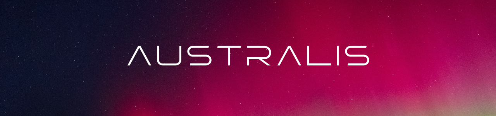
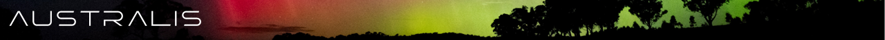

# Australis Avionics Firmware


## Table of Contents
<!-- mtoc-start -->

* [Requirements](#requirements)
  * [Project Includes](#project-includes)
* [Getting Started](#getting-started)
  * [Building the Project](#building-the-project)
    * [Windows](#windows)
    * [Linux/MacOS](#linuxmacos)
* [Acknowledgements](#acknowledgements)
    * [Key Contributors](#key-contributors)
    * [Special Thanks](#special-thanks)

<!-- mtoc-end -->

## Requirements

To successfully install and contribute to the project, ensure you have the following prerequisites installed:

- Git
- Keil uVision IDE (windows only) or alternative editor and GDB debugger
- [GCC for arm (arm-none-eabi-gcc)](https://developer.arm.com/downloads/-/gnu-rm)
- Latest version of Australis Avionics libraries found [here](https://github.com/RMIT-AURC-Team/AuroraV-Avionics-lib/releases)

#### Project Includes

In order to build the project you must ensure the correct include paths are added for the compiler to recognise the headers. At minimum the following must be included:

```shell
/path/to/Australis-Avionics-firmware/Australis-Avionics/Core/Inc
/path/to/Australis-Avionics-firmware/Australis-Avionics/Middlewares/Third_Party/FreeRTOS/Source/include
/path/to/Australis-Avionics-firmware/Australis-Avionics/Middlewares/Third_Party/FreeRTOS/Source/portable/GCC/ARM_CM4F
/path/to/Australis-Avionics-firmware/Australis-Avionics/Middlewares/Third_Party/FreeRTOS/Source/CMSIS_RTOS
/path/to/Australis-Avionics-firmware/Australis-Avionics/Drivers/CMSIS/Include
/path/to/Australis-Avionics-firmware/Australis-Avionics/Drivers/CMSIS/Device/ST/STM32F4xx/Include
/path/to/Australis-Avionics-firmware/Australis-Avionics/Middlewares/Third_Party/FreeRTOS/Source/include
/path/to/Australis-Avionics-firmware/Australis-Avionics/Middlewares/Third_Party/FreeRTOS/Source/portable/GCC/ARM_CM4F
/path/to/Australis-Avionics-firmware/Australis-Avionics/Middlewares/Third_Party/FreeRTOS/Source/CMSIS_RTOS
/path/to/Australis-Avionics-firmware/Australis-Avionics/Drivers/CMSIS/Device/ST/STM32F4xx/Include
/path/to/Australis-Avionics-firmware/Australis-Avionics/Drivers/CMSIS/Include
/path/to/Australis-Avionics-firmware/Australis-Avionics/Drivers/STM32F4xx_HAL_Driver/Inc
/path/to/Australis-Avionics-lib/inc
/path/to/Australis-Avionics-lib/inc/DSP/Include
/path/to/Australis-Avionics-lib/inc/DSP/PrivateInclude
/path/to/Australis-Avionics-lib/inc/CORE/Include
```

If running Tracealyzer also make sure to include these headers:

```shell
/path/to/Australis-Avionics-firmware/Australis-Avionics/Middlewares/Third_Party/TraceRecorder/config
/path/to/Australis-Avionics-firmware/Australis-Avionics/Middlewares/Third_Party/TraceRecorder/include
```
> [!IMPORTANT]
> Additional includes may also be necessary, in particular any directories nested in ```/Australis-Avionics/Core/Inc/``` are required.

## Getting Started

### Building the Project
Before making any changes to the project source it is recommended to ensure the environment is correctly set-up. 

To start, the compiler toolchain ```arm-none-eabi-gcc``` should be installed and visible to whatever build system is intended to be used.

#### Windows
For Windows systems a Keil uVision project is provided in ```/Australis-Avionics/MDK-ARM/``` as ```Australis-Avionics.uvprojx```. 

This project is already configured for building for and debugging on the target platform, however maintenance for this platform is likely to be behind -- one should double check all sources and includes prior to beginning of development to minimise difficulties.

#### Linux/MacOS
> [!TIP]
> Debugging over JTAG on Linux and MacOS systems can be achieved with [JLink GDB Server](https://www.segger.com/products/debug-probes/j-link/tools/j-link-gdb-server/about-j-link-gdb-server/) and any choice of GDB debugger. Documentation on how to set-up and use the GDB server is available [here](https://kb.segger.com/J-Link_GDB_Server)

A CMake profile is available for building the project from the command line across other platforms. To start, make sure the toolchain path is correct in ```/Australis-Avionics/toolchain.cmake```, navigate to ```/Australis-Avionics/Build/``` and run the following:

```shell
cmake ..
cmake --build .
```

Compile time flags can be defined with CMake prior to building. These flags are declared in ```/Australis-Avionics/CMakeLists.txt``` and can be passed at build time.

Once built, the compiled binary will be available as ```/Australis-Avionics/Build/Australis-firmware``` and a ```.map``` file will be generated.

<!-- TO BE RELOCATED TO GITHUB WIKI PAGE
### Coding Standard
The specification of this standard exists to document and define the organisation and naming convention of code to create a well structured and cohesive project. 

These standards aren't to be strict and annoying, but to minimise points of failure and ensure a functional codebase with as little resistance as possible. Justification for these standards is provided to help understand their necessity.

To get started as simply as possible, copy the files located in ```/src``` within any library inside the [lib]() repository and follow the conventions you see there.

#### Formatting

For formatting the project it is recommended that ```clang-format``` is used with the following settings configured in the ```.clangd``` project file:

```yaml
AlignAfterOpenBracket: BlockIndent
AlignOperands: AlignAfterOperator
AlignTrailingComments:
  Kind: Always
  OverEmptyLines: 4
AllowAllParametersOfDeclarationOnNextLine: false
AllowShortLoopsOnASingleLine: true
BinPackParameters: false
BraceWrapping:
  AfterFunction: false
BreakBeforeBraces: Custom
BreakBeforeBinaryOperators: NonAssignment
ColumnLimit: 0
ReflowComments: true
```

#### Library Naming
> **Convention:**   
> Library names should be all lower case without spaces, with the naming convention ```lib<name>```. These names should be kept concise,  e.g. ```libcan```, ```libspi```.

The ```gcc``` toolchain by default expects libraries to be preceeded by ```lib```, so this simplifies the compilation step.

#### Library Functions
> **Convention:**   
> Functions should be proceeded by the library name separated by a single underscore. The library name in this case should follow proper capitilisation, particularly in the case of initialisms and acronyms; e.g. ```MemBuff_append()```, ```LoRa_send()```, ```CAN_init()```.

C does not provide functionality for namespacing or mangling, meaning it is possible for name conflicts that would cause failure to compile in the case that two libraries share functions or defintions of the same name.

Take, for example, a situation where ```CAN``` and ```SPI``` libraries both implement a function ```sendData()```. Attempting to compile the project will error out when linking these libraries due to name conflict.

#### Struct Encapsulation
> **Convention:**   
> Global variables should **not** be used within libraries. If a resource is required to be shared across functions, place them within a library struct with appropriate intitialisation. These structs should follow the same naming convention as library functions. It is not necessary, though it is preferred, to include library functions as pointers within these structs.

As mentioned, C does not support namespaces. Global variables can and will cause logic errors when multiple libraries implement globals sharing common names. The compiler may issue a warning however multiple definitions are legal in C and will not throw an error at compile time, this can be quite difficult to debug.

For an example see the [MemBuff](https://github.com/RMIT-AURC-Team/AuroraV-Avionics-lib/tree/master/membuff/src) implementation. An example skeleton of a library struct implementation can be found [here](https://github.com/RMIT-AURC-Team/AuroraV-Avionics-lib/tree/master/example/src); You may find it easier to copy the example directory entirely and simply rename the files and code elements to align with the library you are working on.
-->

## Acknowledgements
### Key Contributors
| Name              | Role                           |
|:------------------|:-------------------------------|
| Matthew Ricci     | Principal firmware developer   |
| William Houlahan  | Initial driver implementations |
| Benjamin Wilsmore | Initial driver implementations |

### Special Thanks
Other members of the Aurora V Avionics team:
- Hugo Begg 
- Jonathan Chandler
- Jeremy Timotius
- Lucas Webb 

And thank you to everyone who helped make the Aurora and Legacy projects a reality!



---
